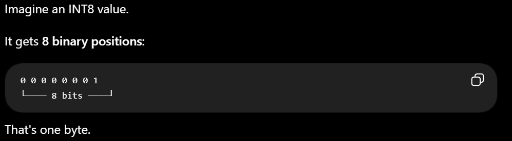
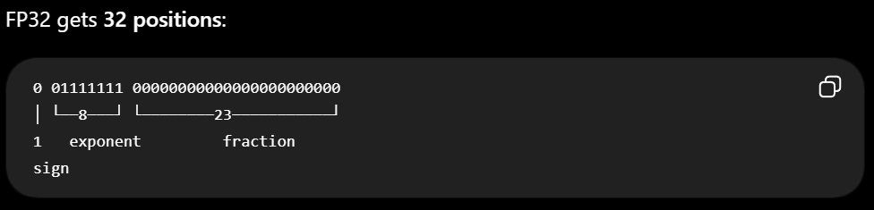

# Day 01 - C++ Basics and First Compile

## What is C++?

C++ is a programming language used for high performance computing.

## What is source code?

Source code is the code base of the program. The source code doesn't necessarily mean the whole program but the exectuibles and the source code and libraries together means a program.

## What is a compiler?

Compiler is the main engine of C++ code. It acrs as a translator between human and machine.

## What is an executable?

Executable is the executable file we develop after complting the source code.

## What is main()?

main() function is the function which is the one that gets sequentially executed line by line for a C++ program. This is the function where the main source code lives apart from library source codes.

## What happens after I change main.cpp?

After i change main.cpp if i dont compile, the exectuable remains the same and then the same program is then run again. If i change syntax, we get a syntax error.

## Why do I need to compile again?

To change the exectuable.

## How is running C++ different from running Python?

In python the interpretor sequentially runs the code line by line at runtime but in c++ we need to compile the source code everytime we make any changes.

## What compiler error did I encounter today?

I encountered an error related to std::cout. I need to understand what std:: means and why cout belongs to it.

## What confused me today?

Why do we need the use of std:: before cout

# Day 02 - Variables, Types, and Input/Output

## Self Notes

1. [[maybe_unused]] is used when the variable might not be used further down: 

    [[maybe_unused]] double pi { 3.14159 };  // Don't complain if pi is unused
    [[maybe_unused]] double gravity { 9.8 }; // Don't complain if gravity is unused
    [[maybe_unused]] double phi { 1.61803 }; // Don't complain if phi is unused
2. Using int x{} , int x() is preferred. mostly using int x{} as if intitalized int x{4.5} , complier will throw an error. Maybe it would be an issue with vectors later on?

## What is a variable?

The variable is the named object/storage that contains the value.

## What is a data type?

data type is a fixed types of data c++ can handle.

## What is the difference between int, float and double?

int is integer, float has fractional and double is double precision of float

## What does bool represent?

bool means boolean values like true or false

## What does char represent?

char is a single unit of charectar in c++

## What is std::string?

string is sequence of many charectars

## What does std::cout do?

it prints out in the console

## What does std::cin do?

it takes user inputs

## What is initialization?

Giving a variable its initial value when the variable is created.

## What is assignment?

assignement is the way a variable can be assigned a value

## Why can an uninitialized variable be dangerous?

it can print out garbage value

## What does << mean when used with std::cout?

insertion operator

## What does >> mean when used with std::cin?

extraction operator

## Why does FP32 require more memory than INT8?

as fp32 is 4 times the int memory.

## What confused me today?

not much, just why fp32 requires more memory than int and how does it look in binary.

# Day 03 - Functions and Clean Code

## What is a function?

function is a way to use the code again and again

## Why are functions useful?

modulartity, readbility and resuablitiy

## What is a parameter?

parameter is a variable decalerd in function definition int func(int parameter,int parameter)

## What is an argument?

argument is the real value for the function func(0,9)

## What is the difference between parameter and argument?

one is initalization and one is setting of value

## What is a return value?

return value is the value used for returning and setting the variable to the memory

## What does void mean for a function?

reutrn nothing

## What is local scope?

which is initatied in local functions, other functions cannot use it until it is declared for use and referenced properly

## What is pass by value?

using value directly

## What is pass by reference?

using address/ pointers to access memory slots 

## What happens if a function modifies a value passed by value?

nothing changes as it is a copy

## What can happen if a function modifies a non-const reference?

value is changed as og is changed as pointed to address

## What does const mean?

constant variable which should not be modified 

## Why might copying a huge Tensor be more expensive than copying an integer?

tensor are huge and intger are smaller

## What confused me today?

const declaration inside a function parameter. also the parameter initialization.

# Day 04 - 